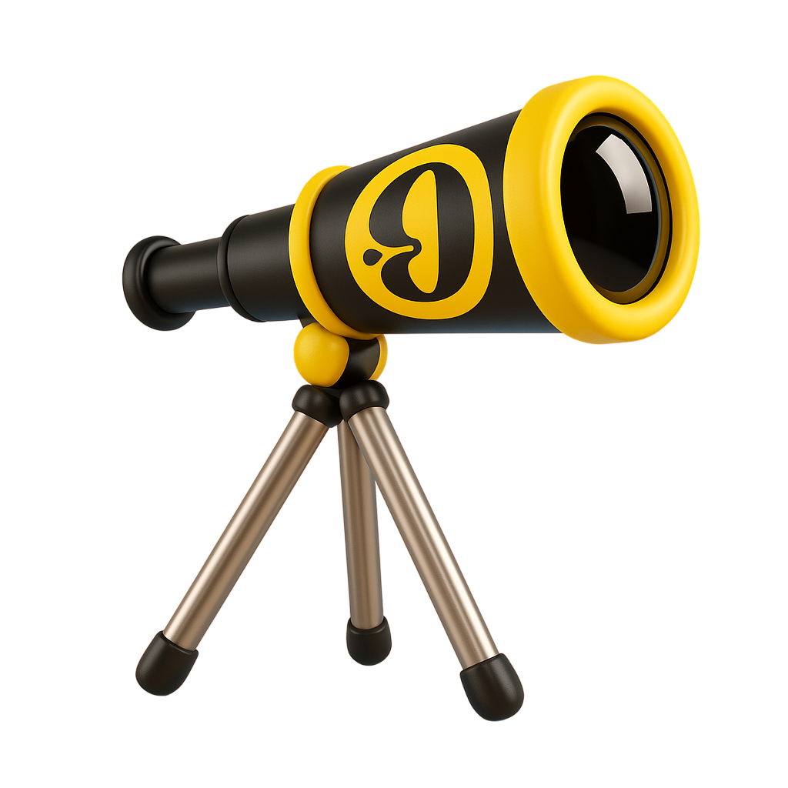
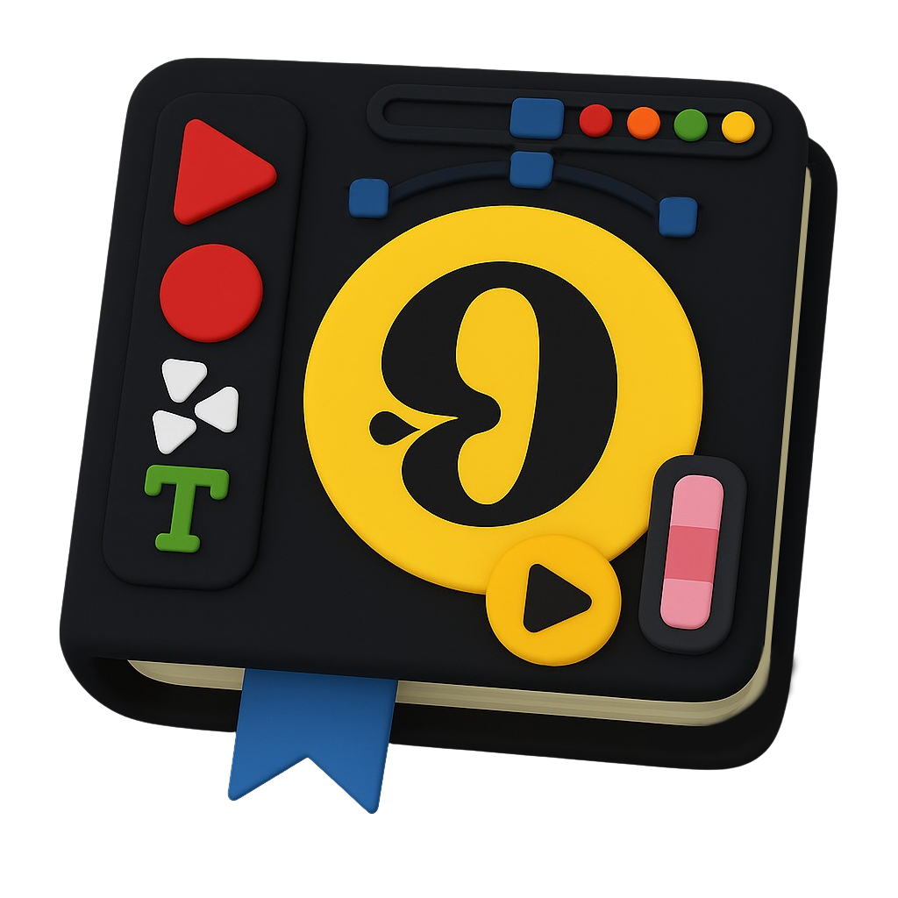

# Horizon Creative – Portfolio Web



## ¿Qué es Horizon Creative?
**Horizon Creative** es una agencia creativa digital especializada en el diseño, desarrollo y promoción de marcas en el entorno online. Nuestro equipo está formado por expertos en diseño web, desarrollo a medida, marketing digital y aplicaciones móviles, ayudando a empresas y emprendedores a destacar en el mundo digital.

La web de Horizon Creative es un portafolio profesional que muestra nuestros servicios, proyectos realizados, equipo y formas de contacto, todo ello con una experiencia visual moderna, animaciones suaves y un diseño responsive.

### Servicios principales:
- Diseño y desarrollo web personalizado
- Estrategias de marketing digital
- Creación de aplicaciones móviles
- Branding y consultoría digital

**Público objetivo:**
- Empresas, startups y profesionales que buscan potenciar su presencia digital y diferenciarse de la competencia.

**Objetivo de la web:**
Presentar la propuesta de valor de Horizon Creative, inspirar confianza y facilitar el contacto para nuevos proyectos.

## Descripción
**Horizon Creative** es una página web de portafolio profesional para agencias creativas, freelancers y estudios de diseño. Permite mostrar proyectos, servicios, equipo y datos de contacto con una experiencia visual moderna y animaciones suaves al hacer scroll.

## Características principales
- **Animaciones de scroll** en todas las secciones (Hero, Servicios, Portfolio, Sobre Nosotros, Footer) usando `framer-motion` y `react-intersection-observer`.
- **Chatbot inteligente** integrado con OpenAI para asistencia automática y gestión de consultas.
- **Sistema de formularios avanzado** con EmailJS para envío automático de emails en modales de cita y planes.
- **Optimización móvil** con prevención de apertura automática del teclado en dispositivos táctiles.
- **Modales interactivos** para solicitud de citas y contratación de planes con validación de formularios.
- Diseño responsive y minimalista, compatible con modo claro/oscuro.
- Secciones para presentación, servicios, portafolio de trabajos, equipo y contacto.
- Código modular y fácil de mantener con componentes reutilizables en React/Next.js.

## Tecnologías utilizadas
- **Next.js** (App Router)
- **React**
- **TypeScript**
- **Tailwind CSS**
- **Framer Motion** (animaciones)
- **react-intersection-observer** (detección de scroll)
- **Lucide React** (iconos)
- **EmailJS** (envío de emails)
- **React Hook Form** (gestión de formularios)
- **Zod** (validación de esquemas)
- **OpenAI API** (chatbot inteligente)

## Funcionalidades avanzadas

### 🤖 Chatbot Inteligente
- Integración con OpenAI para respuestas automáticas
- Interfaz conversacional moderna y responsive
- Optimizado para dispositivos móviles (sin apertura automática del teclado)
- Botones de acción rápida para citas, planes y servicios

### 📧 Sistema de EmailJS
- Envío automático de emails en formularios de contacto, citas y planes
- Doble confirmación: email al cliente y notificación a la empresa
- Validación de formularios con Zod y React Hook Form
- Templates personalizados para diferentes tipos de consulta

### 📱 Optimización Móvil
- Prevención de apertura automática del teclado en dispositivos táctiles
- Detección inteligente de dispositivos móviles
- Experiencia de usuario optimizada para pantallas pequeñas

### 🎯 Modales Interactivos
- Modal de solicitud de citas con campos de fecha y hora
- Modal de contratación de planes (Eco, Medio, Premium)
- Validación en tiempo real y mensajes de error
- Integración completa con sistema de emails

## Estructura del proyecto
```
creative-agency-portfolio/
├── app/
│   ├── api/
│   │   ├── chat/
│   │   └── newsletter.ts
│   ├── components/
│   │   ├── ChatBot.tsx
│   │   ├── Contact.tsx
│   │   ├── Header.tsx
│   │   ├── Hero.tsx
│   │   ├── Services.tsx
│   │   ├── Footer.tsx
│   │   └── modals/
│   │       ├── CitaModal.tsx
│   │       ├── PlanModal.tsx
│   │       └── ServicioModal.tsx
│   ├── sobre-nosotros/
│   │   └── page.tsx
│   └── layout.tsx
├── public/
│   └── logotipo.png
├── package.json
└── README.md
```

## Instalación y uso
1. Clona este repositorio:
   ```bash
   git clone https://github.com/420btc/horizoncreative.git
   cd horizoncreative
   ```
2. Instala las dependencias:
   ```bash
   npm install
   # o si hay problemas con peer dependencies:
   npm install --legacy-peer-deps
   ```
3. Configura las variables de entorno:
   ```bash
   # Crea un archivo .env.local en la raíz del proyecto
   OPENAI_API_KEY=tu_clave_de_openai
   ```

4. Configura EmailJS:
   - Crea una cuenta en [EmailJS](https://www.emailjs.com/)
   - Configura tus templates de email
   - Actualiza las credenciales en los componentes de modales

5. Inicia el servidor de desarrollo:
   ```bash
   npm run dev
   ```
6. Abre [http://localhost:3000](http://localhost:3000) en tu navegador.

## Configuración de servicios

### EmailJS
Para configurar el envío de emails, necesitas:
1. **Service ID**: `service_06mwro7`
2. **Template IDs**:
   - Usuario: `template_fbh9vyx`
   - Empresa: `template_o8x6wug`
3. **Public Key**: `crT-xgI3BjGddLEgY`

### OpenAI API
Para el chatbot inteligente:
1. Obtén tu API key de [OpenAI](https://platform.openai.com/)
2. Agrégala al archivo `.env.local`
3. El chatbot está configurado para usar GPT-3.5-turbo

## Uso de las funcionalidades

### Chatbot
- Haz clic en el ícono del chat en la esquina inferior derecha
- Escribe tu consulta y recibe respuestas automáticas
- Usa los botones de acción rápida para citas, planes o servicios

### Modales de formularios
- **Cita**: Solicita una reunión con campos de fecha y hora
- **Planes**: Contrata servicios (Eco €299, Medio €599, Premium €999)
- **Servicios**: Consulta sobre servicios específicos

### Sistema de emails
- Todos los formularios envían confirmación al usuario
- La empresa recibe notificaciones de nuevas solicitudes
- Validación automática de campos requeridos

## Captura del proyecto


## Autor
**Carlos Freire**  
[GitHub](https://github.com/420btc)

---

> Proyecto desarrollado como portafolio profesional para agencias creativas y freelancers. ¡Personalízalo y hazlo tuyo!
